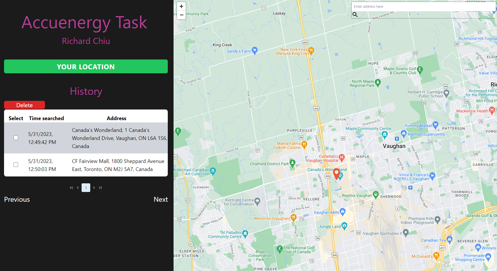

# accuenergy-task

This is a coding task for Accuenergy done by Richard Chiu.
The application utilizes map and geolocation API to display interactive mapping for users.

For ease of demoing, app is deployed at:

```sh
 https://richard-chiu-accuenergy-task.netlify.app/

```

## Features

- Interactive map display
- User's current location detection
- Geolocation services

Note: Clicking on marker or address in sidebar will take you to location on map



### Getting Started

clone repository and install all dependencies.

configure API keys and variables (.env.local)

keys needed:

- firebase firestore (https://firebase.google.com/)
- geoapify (https://www.geoapify.com/)
- googlemaps (https://developers.google.com/maps/documentation/javascript/get-api-key)

### Compile and Minify for Production

npm run build
